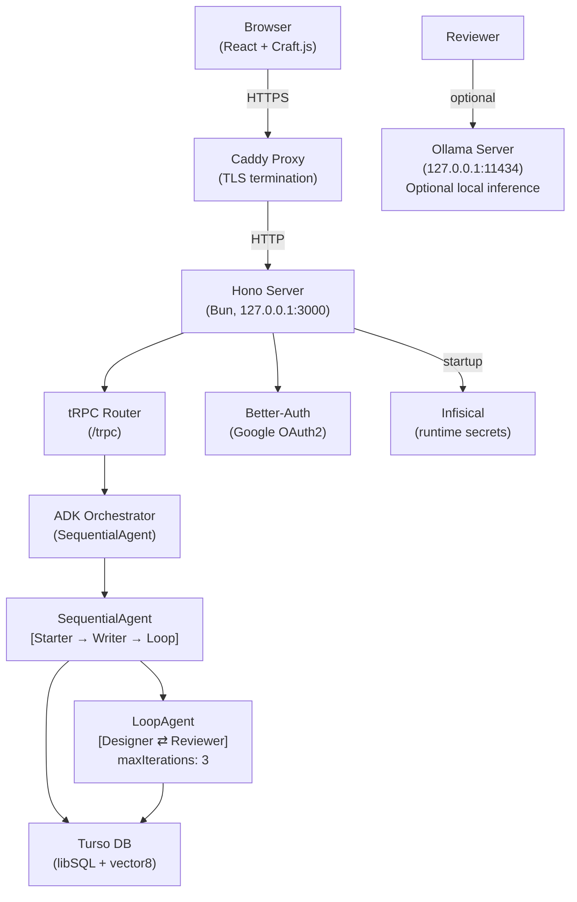
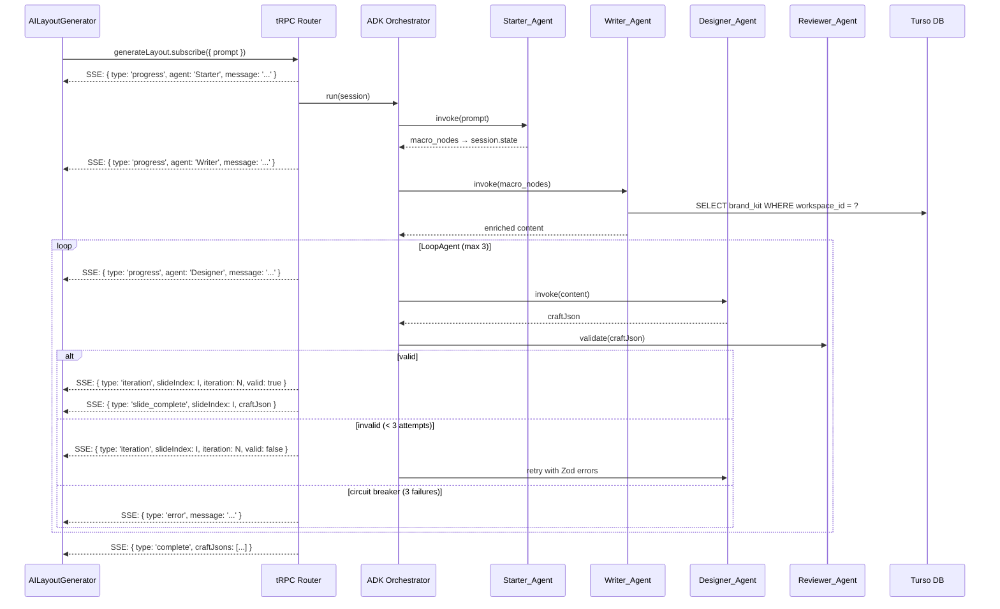

# Design Document: slideflow-backend

## Overview

This document describes the technical design for migrating Slideflow's AI generation from a
browser-side Gemini call to a dedicated backend service. The backend is a Bun + Hono process
that exposes a tRPC v11 API with SSE streaming, orchestrates a multi-agent Google ADK pipeline,
persists data in Turso (libSQL) with native vector8 RAG support, and is secured behind Caddy +
UFW with AEGIS encryption and Infisical secret injection.

The migration is split into four execution phases:

| Phase | Scope |
|-------|-------|
| FA 001 | Core backend setup, Turso local, remove GEMINI_API_KEY from Vite |
| FA 002 | Google ADK multi-agent orchestration + tRPC SSE streaming |
| FA 003 | RAG integration: Brand Kit as vector8 embeddings |
| FA 004 | VPS deploy: Better-Auth, Caddy, UFW, AEGIS, Infisical |

### Key Design Goals

- Zero API keys in the browser bundle
- Tenant-isolated data at every query boundary
- Streaming progress so the UI never shows a blank spinner
- Hard circuit breaker on the AI loop to prevent runaway LLM calls
- Single database abstraction that works identically for local dev and Turso cloud

---

## Architecture



### Request Flow: Layout Generation



---

## Components and Interfaces

### Backend Modules

#### `server/src/index.ts`
Entry point. Initializes Infisical, opens Turso DB, mounts tRPC router on `/trpc`, mounts
Better-Auth handler, and starts the Hono server on `127.0.0.1:3000`.

```typescript
// Startup sequence
1. fetchSecretsFromInfisical()   // exits with code 1 on failure
2. openDatabase(DATABASE_URL)    // exits with code 1 on missing env var
3. runMigrations()               // exits with code 1 on migration failure
4. app.use(cors({ origin: CORS_ORIGIN ?? 'http://localhost:5173' }))  // CORS before all routes
5. app.use('/trpc', trpcHandler)
6. app.use('/auth', betterAuthHandler)
7. Bun.serve({ hostname: '127.0.0.1', port: 3000 })
```

#### `server/src/db/client.ts`
Constructs the Drizzle client from `DATABASE_URL`. Turso runs as an embedded file on disk in
both local development and VPS production (Hostinger) — Turso Cloud is a future migration path,
not the current production target.

`DATABASE_URL` convention:
- Development: `file:local.db` (relative, run from `server/`)
- Production (VPS): `file:/var/data/slideflow/local.db` (absolute path required — relative paths
  are CWD-dependent and unsafe for process-managed services on VPS)
- Future Turso Cloud: `libsql://[db].turso.io` (requires `authToken` code change — see migration
  checklist in `server/README.md`)

**FA 001 implementation** (module side-effect, sufficient until FA 004):
```typescript
import { drizzle } from 'drizzle-orm/libsql'
import { createClient } from '@libsql/client'

const url = process.env.DATABASE_URL
if (!url) { console.error('DATABASE_URL is required'); process.exit(1) }

export const db = drizzle(createClient({ url }))
```

**FA 004 target** (task 7.0 — required before AEGIS encryption via Infisical):
The module-level side-effect must be refactored to an explicit `openDatabase()` async function
so the AEGIS `encryptionKey` fetched from Infisical in startup step 1 is available when
`createClient()` executes in startup step 2:

```typescript
export let db: ReturnType<typeof drizzle>

export async function openDatabase(): Promise<void> {
  const url = process.env.DATABASE_URL
  if (!url) { console.error('DATABASE_URL is required'); process.exit(1) }
  db = drizzle(createClient({ url, encryptionKey: process.env.AEGIS_ENCRYPTION_KEY }))
}
```

#### `server/src/lib/ai.ts`
Single shared Genkit instance consumed by all three LlmAgents. Provider selection is determined
at startup by checking `OLLAMA_BASE_URL`:

```typescript
import { genkit } from 'genkit'
import { googleAI } from '@genkit-ai/googleai'
import { ollama } from 'genkitx-ollama'

// Single source of truth for provider selection.
// - OLLAMA_BASE_URL set  → route all LlmAgent calls to local Ollama (zero token cost)
// - OLLAMA_BASE_URL absent → use Google AI / Gemini API (requires GEMINI_API_KEY)
export const ai = process.env.OLLAMA_BASE_URL
  ? genkit({ plugins: [ollama({ serverAddress: process.env.OLLAMA_BASE_URL })] })
  : genkit({ plugins: [googleAI()] })
```

**Provider rules:**
- `OLLAMA_BASE_URL` set + `GEMINI_API_KEY` absent → valid (Ollama mode, used for local dev/testing)
- `OLLAMA_BASE_URL` absent + `GEMINI_API_KEY` set → valid (Gemini mode, used for production)
- Both absent → pipeline emits SSE `error` event immediately; no LLM call issued
- Both set → `OLLAMA_BASE_URL` takes precedence (Ollama mode)

**Model name convention:**
- Gemini: `GEMINI_MODEL=googleai/gemini-2.0-flash-exp`
- Ollama: `GEMINI_MODEL=qwen2.5-coder:7b` (any model pulled via `ollama pull`)

The `GEMINI_MODEL` env var is reused for both providers — its value is passed directly to
`ai.generate({ model: ... })`. Genkit resolves the model string through the active plugin.

#### `server/src/trpc/router.ts`
Root tRPC router. Composes `generateLayout` and `brandKit` sub-routers. All procedures pass
through the `authMiddleware` which validates the Better-Auth session and injects `workspace_id`
into the tRPC context.

#### `server/src/trpc/procedures/generateLayout.ts`
The `generateLayout` subscription procedure. Accepts `{ prompt: string }`, reads `workspace_id`
from context, creates an `AbortController`, and passes its `signal` to `runPipeline`. Yields
typed SSE events as they arrive from the `AsyncGenerator`. On client disconnect (tRPC
`unsubscribe`), calls `abortController.abort()` to cancel the active ADK session and stop all
pending LLM calls immediately.

#### `server/src/trpc/procedures/brandKit.ts`
CRUD procedures for Brand Kit management: `create`, `list`, `delete`, `setActive`, `migrate`.
On `create`, stores brand tokens with `is_active = false` and the `embedding` blob reserved
for future RAG use (embedding generation is deferred — `embedding` may be null initially).
`setActive` sets `is_active = true` on the chosen kit and `is_active = false` on all others
for the workspace in a single transaction. Also exposes a `migrate` mutation that bulk-inserts
Brand Kits from `localStorage` into `brand_kits` scoped to the authenticated `workspace_id`;
the mutation is idempotent — it skips kits that already exist by name for the workspace.

#### `server/src/agents/pipeline.ts`
Assembles the full ADK pipeline and exposes it as an `AsyncGenerator<SSEEvent>`.
ADK agent lifecycle hooks (`before_agent_callback`, `after_agent_callback`) are used to emit
`progress` events into the generator. The pipeline yields events in real-time as agents execute.

```
SequentialAgent
  ├── Starter_Agent   (LlmAgent — writes macro_nodes[])
  ├── Writer_Agent    (LlmAgent — writes enriched_content[])
  └── SlideLoopAgent  (TypeScript loop over enriched_content[], one slide at a time)
        sets current_slide_index, resets valid/zod_errors, emits slide_complete per slide
        └── LoopAgent (maxIterations: 3, per slide)
              ├── Designer_Agent  (LlmAgent — generates CraftJson for enriched_content[i])
              └── Reviewer_Agent  (pure Zod function — validates bounds, no LLM)
```

Export signature:
```typescript
export async function* runPipeline(
  prompt: string,
  workspaceId: string,
  signal: AbortSignal
): AsyncGenerator<SSEEvent>
```

#### `server/src/agents/starter.ts`
Generates the macro slide graph from the user prompt. Writes `macro_nodes` to `session.state`.

#### `server/src/agents/writer.ts`
Reads `macro_nodes` from `session.state`, fetches the active Brand Kit for the workspace, and
produces per-slide content enriched with brand context. Writes `enriched_content` to `session.state`.

Brand Kit lookup follows a two-level fallback chain:
1. **Active kit**: `SELECT WHERE workspace_id = ? AND is_active = 1 LIMIT 1`
2. **Most recent kit**: `SELECT WHERE workspace_id = ? ORDER BY created_at DESC LIMIT 1`
3. **workspace_defaults**: queried when no Brand Kit exists for the workspace
4. **global_defaults**: used directly if Onboarding_Worker failed for this workspace
5. **Hardcoded defaults**: used if both `workspace_defaults` and `global_defaults` are empty

#### `server/src/agents/designer.ts`
Converts `enriched_content` into a Craft.js-compatible JSON layout. Assigns each node a UUID
via `crypto.randomUUID()`. Writes `craft_json` to `session.state`.

#### `server/src/agents/reviewer.ts`
Pure TypeScript validation function — NOT an LlmAgent. Runs `canvasSchema.safeParse(craftJson)`
deterministically. On failure, writes Zod error details to `session.state['zod_errors']` for
Designer_Agent to consume on the next iteration and sets `session.state['valid'] = false`.
On success, sets `session.state['valid'] = true`. Executes at zero token cost.

#### `server/src/agents/stopChecker.ts`
Implements the ADK `StopChecker` interface. Returns `true` when `session.state['valid'] === true`,
causing the LoopAgent to exit early on successful validation.

#### `server/src/schemas/canvas.ts`
Zod schema enforcing 960×540px bounds on all positional and dimensional values in Craft_JSON.

#### `server/src/schemas/craftJson.ts`
Zod types for the Craft.js node tree structure (node ID, type, props, nodes array).

#### `server/src/auth/better-auth.ts`
Better-Auth configuration: Google OAuth2 provider, session cookie settings, Workspace creation
hook that triggers `Onboarding_Worker`.

#### `server/src/auth/onboarding.ts`
Onboarding worker: copies all rows from `global_defaults` (themes and template definitions)
into the new user's Workspace via a single `INSERT INTO workspace_defaults SELECT ... FROM global_defaults`
SQL statement executed in a single transaction on first user login. This isolates per-workspace
customization and enables future B2B team model without schema changes.

The operation is **idempotent**: before inserting, it checks `WHERE workspace_id = ? LIMIT 1` and
skips if rows already exist — safe to re-run without creating duplicates. If the transaction fails,
the error is logged and the Workspace remains functional; Writer_Agent falls back to querying
`global_defaults` directly so generation is never blocked by an onboarding failure.

#### `server/src/middleware/auth.ts`
tRPC middleware that reads the Better-Auth session from the request cookie, validates it, and
injects `{ userId, workspaceId }` into the tRPC context. Returns HTTP 401 on missing/invalid session.

#### `server/src/middleware/rateLimiter.ts`
Hono middleware applying per-workspace rate limits on the `generateLayout` procedure to prevent
runaway LLM spend. Uses a sliding window; the request ceiling is configurable via the
`RATE_LIMIT_REQUESTS_PER_HOUR` environment variable. Returns HTTP 429 with a `Retry-After`
header when the limit is exceeded.

### Frontend Changes

#### `src/components/editor/AILayoutGenerator.tsx`
Refactored to use `trpc.generateLayout.subscribe()` instead of `generateAILayout()`. Renders
SSE progress events as status text. On `complete` event, calls `actions.deserialize(craftJson)`.

#### `src/lib/geminiService.ts`
Deleted after FA 002 backend ADK pipeline is operational. This file currently contains the
system prompt composition logic and `generateAILayout()` function — both move to the ADK
agent prompts in `server/src/agents/`. The frontend import in `AILayoutGenerator.tsx` is
replaced by `trpc.generateLayout.subscribe()`.

#### `src/hooks/useBrandKitMigration.ts`
A React hook that runs once on first authenticated load. Reads `localStorage.getItem('slideflow-brand-kits')`,
checks if the user's workspace already has Brand Kits via `trpc.brandKit.list.query()`, and
if not, calls `trpc.brandKit.migrate.mutate()` with the parsed localStorage data. On success,
clears `localStorage.removeItem('slideflow-brand-kits')`. On failure, retains localStorage
data for retry on next load.

The hook sets a `migrationAttempted` flag in component state before issuing the `migrate` call
to prevent concurrent duplicate calls (e.g. from React StrictMode double-invoke or component
remounting). The flag is set to `true` immediately before the async call and is not reset on
failure — the retry occurs on the *next* page load, not within the same session.

#### `vite.config.ts`
`define` block entry for `GEMINI_API_KEY` removed.

### SSE Event Contract

```typescript
type SSEEvent =
  | { type: 'progress'; agent: string; message: string }
  | { type: 'iteration'; slideIndex: number; iteration: number; valid: boolean }
  | { type: 'slide_complete'; slideIndex: number; craftJson: CraftJson }
  | { type: 'complete'; craftJsons: CraftJson[] }
  | { type: 'error'; message: string }
```

### tRPC Procedure Signatures

```typescript
// generateLayout — subscription (SSE)
input:  { prompt: string }
output: AsyncIterable<SSEEvent>
auth:   required (workspace_id injected from session)

// brandKit.create — mutation
input:  { name: string; tokens: BrandTokens }
output: { id: string }
auth:   required

// brandKit.list — query
input:  void
output: BrandKit[]
auth:   required

// brandKit.delete — mutation
input:  { id: string }
output: { success: boolean }
auth:   required

// brandKit.setActive — mutation
input:  { id: string }
output: { success: boolean }
auth:   required
note:   sets is_active=true on chosen kit, is_active=false on all others for the workspace (single transaction)

// brandKit.migrate — mutation
input:  { kits: Array<{ name: string; tokens: BrandTokens }> }
output: { migrated: number }
auth:   required
note:   idempotent — skips kits that already exist for the workspace
```

---

## Data Models

### Drizzle Schema (`server/src/db/schema.ts`)

```typescript
import { sqliteTable, text, integer, blob } from 'drizzle-orm/sqlite-core'

export const users = sqliteTable('users', {
  id:         text('id').primaryKey(),
  email:      text('email').notNull().unique(),
  name:       text('name'),
  googleId:   text('google_id').unique(),
  createdAt:  integer('created_at', { mode: 'timestamp' }).notNull(),
})

export const workspaces = sqliteTable('workspaces', {
  id:        text('id').primaryKey(),
  ownerId:   text('owner_id').notNull().references(() => users.id),
  name:      text('name').notNull(),
  createdAt: integer('created_at', { mode: 'timestamp' }).notNull(),
})

// NOTE: `presentations` and `slides` are defined here for schema completeness and future use.
// No tRPC CRUD procedures for these tables are in scope for this spec (FA 001–FA 004).
export const presentations = sqliteTable('presentations', {
  id:          text('id').primaryKey(),
  workspaceId: text('workspace_id').notNull().references(() => workspaces.id),
  title:       text('title').notNull(),
  metadata:    text('metadata'),   // JSON blob (viewport, theme, etc.)
  createdAt:   integer('created_at', { mode: 'timestamp' }).notNull(),
  updatedAt:   integer('updated_at', { mode: 'timestamp' }).notNull(),
})

export const slides = sqliteTable('slides', {
  id:             text('id').primaryKey(),
  workspaceId:    text('workspace_id').notNull().references(() => workspaces.id),
  presentationId: text('presentation_id').notNull().references(() => presentations.id),
  position:       integer('position').notNull(),
  layout:         text('layout').notNull(),  // Craft.js JSON string
  createdAt:      integer('created_at', { mode: 'timestamp' }).notNull(),
})

export const brandKits = sqliteTable('brand_kits', {
  id:             text('id').primaryKey(),
  workspaceId:    text('workspace_id').notNull().references(() => workspaces.id),
  name:           text('name').notNull(),
  tokens:         text('tokens').notNull(),          // JSON: { primary, secondary, fontHeading, fontBody }
  isActive:       integer('is_active', { mode: 'boolean' }).notNull().default(false),
  embedding:      blob('embedding'),                 // vector8 binary, dim=768 (text-embedding-004), stored for future RAG use
  embeddingModel: text('embedding_model').notNull().default('text-embedding-004'),
  createdAt:      integer('created_at', { mode: 'timestamp' }).notNull(),
})

export const globalDefaults = sqliteTable('global_defaults', {
  id:       text('id').primaryKey(),
  type:     text('type').notNull(),   // 'template' | 'theme'
  name:     text('name').notNull(),
  data:     text('data').notNull(),   // JSON
})

// Per-workspace copies of global_defaults; populated by Onboarding_Worker on first login.
// Allows per-workspace customization of templates and themes without mutating global data.
export const workspaceDefaults = sqliteTable('workspace_defaults', {
  id:          text('id').primaryKey(),
  workspaceId: text('workspace_id').notNull().references(() => workspaces.id),
  type:        text('type').notNull(),   // 'template' | 'theme'
  name:        text('name').notNull(),
  data:        text('data').notNull(),   // JSON (may be customized per workspace)
})
```

### Brand Kit Selection Pattern

The current implementation uses an explicit `is_active` flag for deterministic, user-controlled
selection. The `embedding` column is stored for future semantic RAG use when needed.

```sql
-- Primary: select the kit the user marked as active
SELECT id, name, tokens
FROM brand_kits
WHERE workspace_id = ?
  AND is_active = 1
LIMIT 1

-- Fallback: most recently created kit (if none is active)
SELECT id, name, tokens
FROM brand_kits
WHERE workspace_id = ?
ORDER BY created_at DESC
LIMIT 1
```

The `WHERE workspace_id = ?` filter is mandatory on ALL brand_kit queries to enforce tenant
isolation. Future semantic search will add `ORDER BY vector_distance_cos(embedding, vector8(?))`
to the fallback query when multi-kit RAG is needed.

### Session State Schema

```typescript
interface SessionState {
  macro_nodes:          MacroNode[]       // written by Starter_Agent
  enriched_content:     EnrichedSlide[]   // written by Writer_Agent (one entry per slide)
  current_slide_index:  number            // managed by SlideLoopAgent
  craft_jsons:          CraftJson[]       // accumulates one entry per slide (Designer_Agent)
  zod_errors:           string | null     // written by Reviewer_Agent on failure (reset per iteration)
  valid:                boolean           // written by Reviewer_Agent on success (reset per slide)
}
```

### Craft.js Node ID Contract

Every node in a generated `CraftJson` tree MUST have its `id` field set to
`crypto.randomUUID()` at generation time. This prevents deserialization collisions when
multiple generated layouts are loaded into the same Craft.js editor instance.

The existing frontend uses `Date.now()` combined with random suffixes to generate node IDs
when cloning blocks (see `clipboard.ts`). The Designer_Agent takes over this responsibility
for AI-generated layouts, using UUID v4 to guarantee sufficient entropy across concurrent
generation sessions.

```typescript
// Designer_Agent node factory
function makeNode(type: string, props: object, children: string[]): [string, CraftNode] {
  const id = crypto.randomUUID()
  return [id, { type, props, nodes: children, linkedNodes: {} }]
}
```


---

## Correctness Properties

*A property is a characteristic or behavior that should hold true across all valid executions of a system — essentially, a formal statement about what the system should do. Properties serve as the bridge between human-readable specifications and machine-verifiable correctness guarantees.*

### Property 1: Tenant-scoped tables always carry workspace_id

*For any* tenant-scoped table in the Drizzle schema (`presentations`, `slides`, `brand_kits`, `workspace_defaults`),
the table definition SHALL include a non-null `workspace_id` foreign key column referencing
the `workspaces` table.

**Validates: Requirements 2.2**

---

### Property 2: Session state contains macro_nodes after Starter_Agent

*For any* valid user prompt, after the SequentialAgent runs Starter_Agent to completion,
`session.state['macro_nodes']` SHALL be a non-empty array before Writer_Agent begins execution.

**Validates: Requirements 3.3, 3.2**

---

### Property 3: Canvas_Schema rejects out-of-bounds layouts

*For any* Craft_JSON layout where any positional value (`x`, `y`) or dimensional value
(`width`, `height`) exceeds the 960×540px artboard bounds, the Canvas_Schema SHALL return
a Zod validation error. Conversely, for any layout where all values are within bounds,
the Canvas_Schema SHALL return a success result.

**Validates: Requirements 4.1**

---

### Property 4: Validation failure triggers retry with Zod error context

*For any* Designer_Agent output that fails Canvas_Schema validation (and the iteration count
is less than 3), the LoopAgent SHALL invoke Designer_Agent again with the Zod error details
appended to the prompt, and the retry count SHALL increment by exactly 1.

**Validates: Requirements 4.2, 4.3**

---

### Property 5: Circuit breaker terminates loop after 3 consecutive failures

*For any* sequence of exactly 3 consecutive Canvas_Schema validation failures within a single
LoopAgent session, the LoopAgent SHALL terminate and the tRPC procedure SHALL emit an SSE
error event rather than invoking Designer_Agent a fourth time.

**Validates: Requirements 4.5**

---

### Property 6: All generated Craft.js node IDs are unique UUIDs

*For any* Craft_JSON tree produced by Designer_Agent, every node in the tree SHALL have a
distinct `id` value that conforms to the UUID v4 format. No two nodes in the same tree
SHALL share an `id`.

**Validates: Requirements 4.6**

---

### Property 7: SSE stream emits typed progress event on each agent transition

*For any* generation run, each transition between agents in the SequentialAgent (Starter →
Writer → LoopAgent entry) SHALL cause the SSE stream to emit an event of type `'progress'`
containing a non-empty `agent` string and a non-empty `message` string before the next
agent begins execution.

**Validates: Requirements 5.2**

---

### Property 8: SSE stream emits iteration event after each LoopAgent cycle

*For any* LoopAgent iteration (whether the validation passes or fails), the SSE stream SHALL
emit an event of type `'iteration'` containing the correct `iteration` number (1-indexed)
and a `valid` boolean matching the Canvas_Schema result for that cycle.

**Validates: Requirements 5.3**

---

### Property 9: Successful generation ends with a complete SSE event

*For any* generation run that produces a valid Craft_JSON layout, the final event emitted
on the SSE stream SHALL be of type `'complete'` and SHALL contain the full `craftJson`
payload. No further events SHALL be emitted after the `'complete'` event.

**Validates: Requirements 5.4**

---

### Property 10: Unrecoverable errors produce a closed SSE error event

*For any* unrecoverable error during generation (circuit breaker exhaustion, missing API key,
DB failure), the SSE stream SHALL emit exactly one event of type `'error'` with a non-empty
`message` string, and the stream SHALL close immediately after.

**Validates: Requirements 5.5**

---

### Property 11: Brand Kit RAG query is strictly tenant-isolated

*For any* two workspaces W1 and W2 that each have a Brand Kit stored, a RAG query executed
with `workspace_id = W1` SHALL never return a Brand Kit belonging to W2 as any result in
the result set, regardless of embedding similarity.

**Validates: Requirements 6.4, 7.5**

---

### Property 12: Brand Kit round-trip retrieval

*For any* Brand Kit B stored for workspace W, querying `brand_kits` via `vector_distance_cos`
with `WHERE workspace_id = W` SHALL return B as the top result when the query embedding is
derived from B's own token set.

**Validates: Requirements 6.6, 6.2**

---

### Property 13: Unauthenticated requests receive HTTP 401

*For any* tRPC request that does not include a valid Better-Auth session token, the tRPC
middleware SHALL reject the request with an HTTP 401 response and SHALL NOT invoke any
procedure handler or ADK agent.

**Validates: Requirements 7.3**

---

### Property 14: Onboarding copies all global_defaults for new users

*For any* new user U who authenticates for the first time, after the Onboarding_Worker
completes, the count of workspace-scoped rows in the user's Workspace SHALL equal the
count of rows in `global_defaults` at the time of onboarding.

**Validates: Requirements 7.2**

---

### Property 15: AILayoutGenerator deserializes complete SSE payload

*For any* SSE `'complete'` event received by AILayoutGenerator, the component SHALL call
`actions.deserialize()` with the `craftJson` from the event payload, and the Craft.js
editor state SHALL reflect the deserialized layout.

**Validates: Requirements 9.3**

---

### Property 16: AILayoutGenerator updates status text from progress events

*For any* SSE `'progress'` event received by AILayoutGenerator, the component's loading
indicator text SHALL be updated to reflect the `message` field from that event before the
next render cycle.

**Validates: Requirements 9.4, 5.6**

---

### Property 17: localStorage migration is idempotent

*For any* workspace W that already has N Brand Kits in Turso_DB, calling `brandKit.migrate`
with any array of brand token objects SHALL NOT create duplicate Brand Kit records for kits
that already exist by name in W. The total Brand Kit count for W after migration SHALL equal
the count of unique kit names across the existing kits and the migrated kits.

**Validates: Requirements 10.2, 10.4**

---

### Property 18: Reviewer_Agent validates deterministically without LLM

*For any* Craft_JSON input, the Reviewer_Agent SHALL produce identical pass/fail results
on every invocation given the same input, without invoking any LLM model. The validation
result SHALL depend exclusively on the Zod Canvas_Schema evaluation.

**Validates: Requirements 11.3**

---

## Decision Log & Trade-offs

| Decision | Chosen Approach | Alternative Considered | Justification |
|----------|----------------|----------------------|---------------|
| **Database** | **Turso (libSQL) embedded em disco — dev local e VPS Hostinger** | PostgreSQL | Driver único (`@libsql/client`) funciona em ambos os ambientes; sem dependência de Docker; suporte nativo a `vector8` elimina banco vetorial separado. **Turso Cloud não é o alvo de produção atual** — o banco roda como arquivo no disco da VPS até o gatilho de migração: 500 usuários ativos OU 10 GB de `.db`. A migração para Turso Cloud exige alterações pontuais em `client.ts` e `drizzle.config.ts` (adição de `authToken`). |
| **Reviewer Inference** | **Pure Zod validation (no LLM)** | Gemini/Ollama for Reviewer | *Cost & determinism:* The Reviewer_Agent validates structural bounds (960×540) — a numeric constraint that Zod evaluates in microseconds at zero token cost. Using an LLM for this step would be expensive, probabilistic, and slower. `OLLAMA_BASE_URL` applies only to the three creative LlmAgents (Starter, Writer, Designer). |
| **Secret Manager** | **Infisical (default, switchable to Doppler)** | Hardcoded `.env` | Both Infisical and Doppler are valid per the ADD. The bootstrap module (`server/src/secrets/`) is the single integration point; swapping providers requires changing only that file. Infisical is the default implementation. |

---

## Error Handling

### Startup Errors (Fatal — process exits with code 1)

| Condition | Behavior |
|-----------|----------|
| `DATABASE_URL` env var absent | Log descriptive error, `process.exit(1)` |
| Infisical unreachable | Log descriptive error, `process.exit(1)` |
| `drizzle-kit` migration failure | Log migration error, `process.exit(1)` |

### Runtime Errors (Non-fatal — returned to client via SSE or tRPC error)

| Condition | Behavior |
|-----------|----------|
| `GEMINI_API_KEY` absent at generation time | SSE `error` event, stream closes |
| Canvas_Schema fails 3 times (circuit breaker) | SSE `error` event with Zod details, stream closes |
| LLM call exceeds `LLM_CALL_TIMEOUT_MS` | Treated as iteration failure; increments retry counter; after 3 timeouts: SSE `error` event, stream closes |
| DB query failure during generation | SSE `error` event, stream closes |
| Unauthenticated tRPC request | HTTP 401, no handler invoked |
| Brand Kit not found for workspace | Fallback to `global_defaults`, generation continues |

### Error Response Shape

All SSE error events conform to the discriminated union:
```typescript
{ type: 'error'; message: string }
```

All tRPC procedure errors use standard tRPC error codes (`UNAUTHORIZED`, `INTERNAL_SERVER_ERROR`,
`BAD_REQUEST`) so the frontend tRPC client can handle them uniformly.

---

## Testing Strategy

### Dual Testing Approach

Both unit tests and property-based tests are required. They are complementary:
- Unit tests catch concrete bugs at specific inputs and integration boundaries
- Property tests verify universal correctness across the full input space

### Property-Based Testing

**Library**: [`fast-check`](https://github.com/dubzzz/fast-check) (TypeScript-native, works with Bun)

**Configuration**: Each property test MUST run a minimum of **100 iterations**.

**Tag format**: Each property test MUST include a comment:
```
// Feature: slideflow-backend, Property N: <property_text>
```

**Property test mapping** (one test per property):

| Property | Test file | fast-check arbitraries |
|----------|-----------|------------------------|
| P1: Tenant tables have workspace_id | `schema.test.ts` | N/A (static schema inspection) |
| P2: macro_nodes after Starter_Agent | `pipeline.test.ts` | `fc.string()` for prompts |
| P3: Canvas_Schema bounds validation | `canvas.test.ts` | `fc.record({ x, y, width, height })` with out-of-bounds values |
| P4: Validation failure triggers retry | `loopAgent.test.ts` | `fc.array(fc.record(...))` for invalid layouts |
| P5: Circuit breaker at 3 failures | `loopAgent.test.ts` | Mocked Designer always failing |
| P6: Unique UUID node IDs | `designer.test.ts` | `fc.string()` for content inputs |
| P7: Progress event on agent transition | `sse.test.ts` | `fc.string()` for prompts |
| P8: Iteration event per loop cycle | `sse.test.ts` | `fc.integer({ min: 1, max: 3 })` |
| P9: Complete event on success | `sse.test.ts` | `fc.string()` for prompts |
| P10: Error event on failure | `sse.test.ts` | Mocked failure scenarios |
| P11: RAG tenant isolation | `rag.test.ts` | `fc.uuid()` for workspace IDs, `fc.record(...)` for brand kits |
| P12: Brand Kit round-trip | `rag.test.ts` | `fc.record(...)` for brand token sets |
| P13: 401 on unauthenticated request | `auth.test.ts` | `fc.string()` for invalid tokens |
| P14: Onboarding copies global_defaults | `onboarding.test.ts` | `fc.array(fc.record(...))` for global_defaults rows |
| P15: AILayoutGenerator deserializes | `AILayoutGenerator.test.tsx` | `fc.record(...)` for craftJson |
| P16: AILayoutGenerator updates status | `AILayoutGenerator.test.tsx` | `fc.string()` for agent/message |
| P17: localStorage migration idempotent | `rag.test.ts` | `fc.array(fc.record(...))` for existing kits + migrated kits |
| P18: Reviewer validates deterministically without LLM | `loopAgent.test.ts` | Same CraftJson input, multiple calls |

### Unit Tests

Unit tests focus on:
- Specific examples demonstrating correct behavior (startup sequence, OAuth flow)
- Integration points between components (tRPC ↔ ADK, ADK ↔ Turso)
- Error conditions and edge cases (missing env vars, Infisical unreachable)

**Key unit test cases**:
- Server starts and responds on `127.0.0.1:3000`
- `/trpc` route returns valid tRPC response
- Missing `DATABASE_URL` causes `process.exit(1)`
- Missing `GEMINI_API_KEY` returns SSE error without LLM call
- `geminiService.ts` file does not exist in `src/lib/`
- `vite.config.ts` does not contain `GEMINI_API_KEY` in `define` block
- Infisical unreachable causes `process.exit(1)`
- `global_defaults` fallback when no Brand Kit exists

### Test File Structure

```
server/
  src/
    __tests__/
      schema.test.ts          # Drizzle schema structure tests
      canvas.test.ts          # Canvas_Schema Zod validation (P3)
      pipeline.test.ts        # ADK SequentialAgent flow (P2)
      loopAgent.test.ts       # LoopAgent circuit breaker (P4, P5)
      designer.test.ts        # UUID node ID generation (P6)
      sse.test.ts             # SSE event emission (P7–P10)
      rag.test.ts             # Brand Kit RAG + tenant isolation (P11, P12)
      auth.test.ts            # Auth middleware 401 behavior (P13)
      onboarding.test.ts      # Onboarding worker (P14)
      startup.test.ts         # Fatal startup error conditions

src/
  components/editor/
    __tests__/
      AILayoutGenerator.test.tsx  # Frontend SSE consumption (P15, P16)
```
