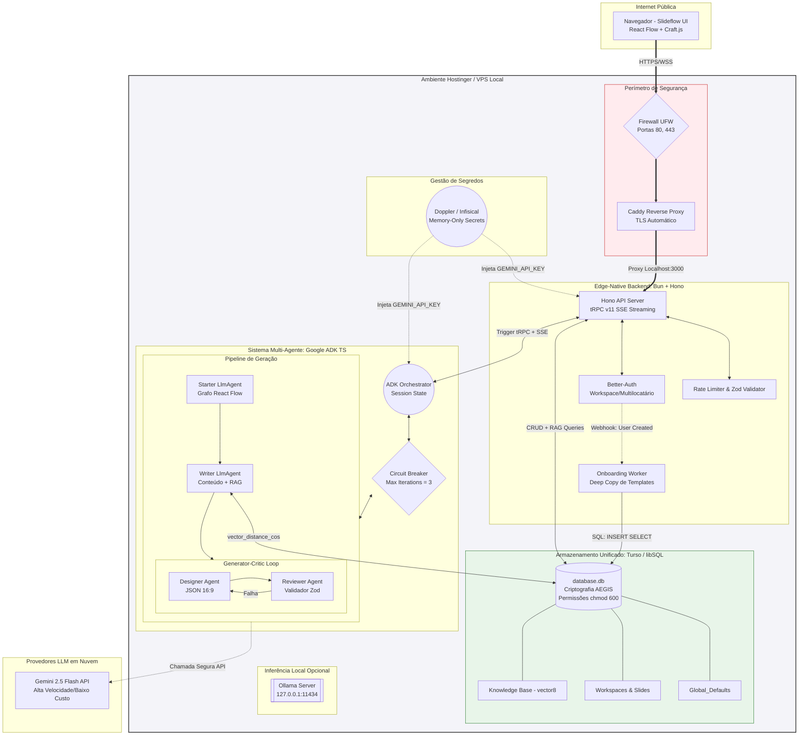

Como Arquiteto de Soluções de nível Staff/Principal, preparei a versão final e consolidada do **Documento de Design de Arquitetura (ADD)** para o Slideflow. 

Este documento foi refinado para refletir o estado da arte das tecnologias em 2026 (como o Turso v0.5.0 e a estabilização do tRPC v11), garantindo que a sua equipe de engenharia tenha todas as justificativas técnicas, diagramas e direcionamentos de segurança necessários para iniciar a implementação do projeto "Self-Hosted / Local-First".

---

# Documento de Design de Arquitetura (ADD): Slideflow

## 1. Executive Summary

O **Slideflow** é um "motor gráfico de narrativas" focado na criação de apresentações não lineares (React Flow para macroestrutura; Craft.js restrito a 960x540 para microestrutura). O desafio técnico central é a orquestração multi-agente de Inteligência Artificial para co-criação de conteúdo, equilibrando criatividade generativa com a rigidez dos esquemas visuais (JSON).

Esta arquitetura propõe um paradigma **Zero-Trust, Local-First e 100% TypeScript**.
A camada transacional (Backend) e a camada cognitiva (IA) rodarão no mesmo ambiente (VPS/Single-Node) visando custo reduzido (Zero-Ops Cloud) e baixíssima latência. A persistência é unificada no **Turso (libSQL)**, que na sua versão 0.5.0 de 2026, suporta gravações concorrentes (MVCC) e busca vetorial nativa (`vector8`) no próprio arquivo `.db`. O motor de IA é orquestrado pelo **Google ADK para TypeScript**, permitindo delegação de tarefas via *LoopAgents* rigorosos com inferência flexível (Gemini 2.5 Flash via API ou Ollama local). A segurança é implementada em profundidade, desde proxies reversos (Caddy) até criptografia nativa no nível da página do banco de dados.

---

## 2. System Architecture Diagram

---

## 3. Detailed Components

### 3.1. API & Backend Transacional (Bun + Hono + tRPC v11)
*   **Runtime & Framework:** Utilizaremos a stack **Bun + Hono**. O Hono é excepcionalmente otimizado, entregando rotas rápidas e suportando *streaming* de alta concorrência com um footprint de RAM mínimo (ideal para VPS).
*   **tRPC v11 SSE:** A comunicação com o cliente React usará o novo `sse` no `initTRPC.create()`. O padrão *Server-Sent Events* substitui WebSockets complexos para enviar em tempo real a UI os estados do pensamento dos agentes do ADK (ex: *"Agent_Designer está formatando o layout..."*). O contrato de eventos inclui: `progress` (transição de agente), `iteration` (resultado por slide+iteração), `slide_complete` (CraftJson de um slide pronto) e `complete` (array `craftJsons[]` final).
*   **CORS:** O servidor Hono expõe um middleware `cors()` como primeiro handler, com origem configurável via variável de ambiente `CORS_ORIGIN` (default: `http://localhost:5173` em desenvolvimento).
*   **Autenticação e Multi-Tenancy:** Implementado via **Better-Auth**. O modelo de dados gira em torno do `Workspace`. Ao criar uma conta (Google/Senha), o *Onboarding Worker* copia as definições de *Global_Defaults* (temas e fontes do sistema) para o Workspace do usuário via um `INSERT INTO ... SELECT` em SQL, isolando a customização e pavimentando o futuro para o modelo B2B (Times).

### 3.2. Camada de Dados Unificada (Turso v0.5.0 / libSQL)
O Turso funciona como um arquivo embutido (`database.db`), eliminando a necessidade de contêineres separados para bancos relacionais e vetoriais.
*   **Concorrência Real (MVCC):** O Turso 0.5.0 suporta a instrução `BEGIN CONCURRENT`, baseada em Controle de Concorrência Multiversão (MVCC). Isso permite que o *Writer Agent* e o *Designer Agent* leiam e escrevam dados do usuário de forma assíncrona, sem gerar eventos de travamento de banco (*Database Locked*).
*   **RAG com `vector8`:** Usaremos o tipo quantizado `vector8` para economia massiva de RAM no servidor (75% menor que o float32) mantendo a mesma qualidade. A coluna `embedding` é armazenada para uso futuro com `vector_distance_cos`. Na implementação atual (FA 001–FA 004), a seleção do Brand Kit é determinística via flag `is_active` (kit marcado pelo usuário) com fallback ao kit criado mais recentemente — eliminando a necessidade de inferência semântica no MVP.
*   **`workspace_defaults`:** Tabela per-workspace gerada pelo *Onboarding Worker* via `INSERT INTO workspace_defaults SELECT ... FROM global_defaults` em transação única na primeira autenticação. O *Writer Agent* usa esta tabela como fallback de tokens visuais quando nenhum Brand Kit existe para o workspace.

### 3.3. Cognitive Engine (Google ADK para TypeScript)
O motor cognitivo abandona grafos manuais instáveis em prol da abstração de *Papéis e Hierarquia* nativa do ADK (`@google/adk`).
*   **Isolamento de Estado:** O estado de curto prazo transita fluidamente por `session.state`. O agente *Starter* deposita a macroestrutura no `session.state['macro_nodes']`, lido na sequência pelos demais agentes.
*   **Pipeline de Execução e `LoopAgent`:**
    *   Utilizamos um `SequentialAgent` para orquestrar a passagem do *Starter* -> *Writer*.
    *   Em seguida, um `SlideLoopAgent` (TypeScript puro) itera sobre o array `enriched_content[]`, executando para cada slide um `LoopAgent` (*Generator-Critic Pattern*). O *Designer* gera o JSON do Craft.js e o *QA Reviewer* — **uma função TypeScript/Zod pura, sem LLM** — valida os limites do canvas (960×540). Se violados, força o *Designer* a corrigir. O loop é encerrado via `StopChecker` quando a validação passa, ou após `maxIterations: 3` falhas consecutivas (Circuit Breaker). Os resultados acumulam em `craft_jsons[]` no `session.state`.
    *   **Cancelamento:** Cada sessão de geração é vinculada a um `AbortController`. Se o cliente desconectar do SSE, `abortController.abort()` é chamado imediatamente, cancelando qualquer chamada LLM pendente.
    *   **Timeout por chamada LLM:** Cada chamada individual ao Gemini é envolvida em `Promise.race([call, timeout(LLM_CALL_TIMEOUT_MS)])`. Em caso de timeout, o erro é tratado como falha de iteração e incrementa o contador do LoopAgent.

---

## 4. Infrastructure & Security (Hardening)

Como donos da VPS, implementamos uma postura *Zero-Trust*:
1.  **Proteção de Perímetro:** Um Firewall (UFW) restringe conexões de rede expondo apenas as portas 80 (para redirecionamento) e 443 (HTTPS). O **Caddy Server** atuará como proxy reverso gerenciando os certificados TLS via Let's Encrypt automaticamente, enquanto oculta o servidor Bun que rodará em `127.0.0.1:3000`.
2.  **Criptografia em Repouso:** O banco Turso local habilitará a criptografia nativa no nível da página (AEGIS), inviabilizando acesso aos dados de clientes caso o disco da VPS sofra exfiltração. O arquivo `.db` em si possuirá a restrição Linux `chmod 600`.
3.  **Circuit Breakers para LLMs (Gestão de Custos):** Para prevenir que o `LoopAgent` de Qualidade consuma todo o orçamento na API do Gemini devido à alucinações matemáticas (tentar enquadrar posições incorretamente no JSON), aplicamos `maxIterations: 3` na configuração do laço e "Timeouts" estritos de resposta. Após 3 erros, a tarefa falha graciosamente.
4.  **Gestão de Segredos:** Nenhuma variável de ambiente será "hardcoded". Senhas do banco de dados e a chave da Gemini API são injetadas em tempo de execução na memória pelo **Infisical** (ou Doppler).

---

## 5. Decision Log & Trade-offs

| Componente | Opção Escolhida | Alternativa Descartada | Justificativa do *Trade-off* ("It depends") |
| :--- | :--- | :--- | :--- |
| **Database** | **Turso Local (libSQL)** | **PostgreSQL (Cloud SQL)** | *Custos & Escalabilidade:* Num primeiro momento (Bootstrap/SaaS em VPS), pagar por serviços gerenciados corrói o *runway*. O Turso 0.5.0 processa RAG e SQL concorrentemente em um arquivo único. A transição para Nuvem (Turso Cloud) no futuro exige alteração zero no código da aplicação — **desde que** o acesso seja abstraído em `src/db/client.ts` com URL via env var desde o dia 1. Features exclusivas do modo embedded (AEGIS, `BEGIN CONCURRENT`, `chmod 600`) devem ser documentadas como "local-only" com substitutos mapeados. Gatilho de migração definido: 500 usuários ativos ou 10 GB de `.db`. |
| **AI Framework** | **Google ADK TS** | **LangGraph.js** | *Complexidade vs Governança:* O LangGraph entrega máxima granularidade via grafos puros. Contudo, o ADK Typescript fornece primitivas opinativas (`SequentialAgent`, `LoopAgent` com `maxIterations`) construídas exatamente para mitigar alucinações em sistemas de IA voltados a geração de código (ou layouts JSON como o Craft.js). |
| **Multi-Agent Auth** | **Isolamento por Workspace (RLS lógico)** | **Modelagem de Sessões por IA** | Injetaremos o `workspace_id` do *Better-Auth* no `InvocationContext` do ADK. Isso amarra os vetores RAG ao cliente (Tenant), garantindo que a IA da Empresa A seja incapaz tecnicamente de ler as Diretrizes de Marca (Brand Kit) da Empresa B no momento da similaridade de cosseno. |
| **Reviewer Agent** | **Função Zod pura (zero LLM)** | **LlmAgent com Gemini ou Ollama** | A validação do artboard (960×540) é uma restrição numérica determinística — Zod avalia em microssegundos com custo zero de tokens. Um LLM para este passo seria caro, probabilístico e mais lento. O `OLLAMA_BASE_URL` aplica-se apenas aos três LlmAgents criativos (Starter, Writer, Designer). |
| **Seleção de Brand Kit** | **Flag `is_active` + fallback por recência** | **`vector_distance_cos` no MVP** | Seleção determinística controlada pelo usuário é suficiente para o MVP e elimina a necessidade de geração de embeddings na criação do kit. A coluna `embedding` é armazenada para uso futuro com RAG semântico multi-kit quando necessário. |

---

## 6. Next Steps & Roadmap

Este é o plano de ataque para a equipe de engenharia:
1.  **Semana 1: Setup Core & Infraestrutura:** Configurar o repositório Bun/TypeScript. Subir o Caddy Server, o UFW e a inicialização de segredos via Infisical. Definir o esquema relacional com Drizzle (Users, Workspaces, Slides) no arquivo `.db` local do Turso habilitando o `MVCC`.
2.  **Semana 2: Auth & Webhooks de Onboarding:** Plugar o Better-Auth com OAuth2.0 do Google. Desenvolver o hook backend para a cópia assíncrona dos templates padrão (da tabela `Global_Defaults` para o escopo do usuário novo).
3.  **Semana 3: Zod e RAG Base:** Criar e testar os *schemas* rigorosos de Zod validando o artboard 16:9 (960x540). Armazenar exemplos de slides perfeitos em `vector8` no Turso para os testes de busca de RAG que ancorarão o *Designer Agent*.
4.  **Semana 4: Orquestração ADK + SSE:** Implementar o fluxo base do Google ADK TypeScript. Integrar o envio do status de progresso (via `session.state`) diretamente pelo tRPC (usando `sse`) para a interface React Flow ser atualizada iterativamente aos olhos do usuário.

**🔍 Avaliação de Viabilidade:**
Esta arquitetura centraliza-se na redução de partes móveis (eliminando a necessidade de contêineres Redis, Pinecone e Message Brokers), substituindo-os pelo poder unificado de bancos Edge-Native modernos e orquestradores estruturados. Está aprovada para suporte a alto tráfego com custos de infraestrutura virtualmente irrelevantes (≤ $15/mês em infra local + custos dinâmicos da API do LLM).