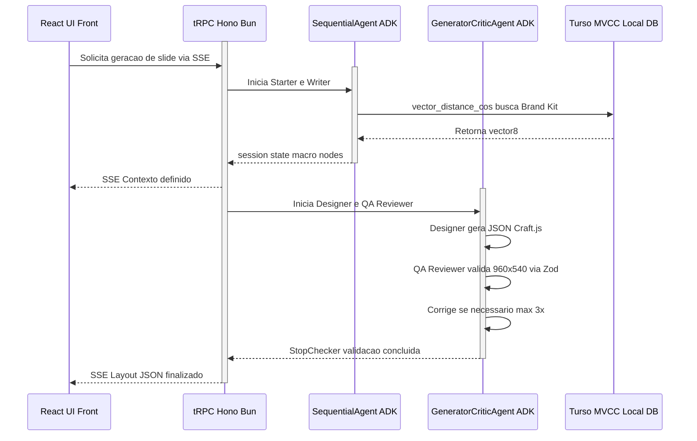

Como **Product Manager e Arquiteto de Soluções** do SlideFlow, revisei a especificação para garantir total aderência ao nosso novo Documento de Design de Arquitetura (ADD). A transição de um MVP puramente *front-end* para uma arquitetura *Zero-Trust e Local-First* exige que amarremos cada fase de execução aos componentes técnicos definidos.

Abaixo, apresento a PRD refatorada (Modo PS+), mapeando diretamente as expectativas de produto aos tópicos de arquitetura de engenharia.

---

# PRD Técnica: Orquestração do Motor Cognitivo e Agentes de IA (SlideFlow)

## 1. Visão Geral e Objetivo
Transferir a inteligência generativa do SlideFlow — atualmente acoplada de forma insegura no cliente React/Vite com injeção de `GEMINI_API_KEY` — para um **Backend Transacional e Cognitivo unificado** rodando em **Bun + Hono**. O objetivo é orquestrar múltiplos agentes de IA via **Google ADK para TypeScript**, garantindo que a geração de layouts JSON para o Craft.js obedeça rigorosamente ao limite do *artboard* de 960x540 através de validação de esquemas, sem perder a agilidade do desenvolvimento local.

## 2. Fases de Execução & Link Arquitetural

### FA 001 - Setup da Camada de Dados e Motor Local
- **Descrição:** Inicializar a fundação do backend visando *Zero-Ops*.
- **Link com Arquitetura:** Refere-se à **Seção 3.1 (API & Backend)** e **Seção 3.2 (Camada de Dados Unificada)** do ADD.
- **Expectativas:** 
  - Inicializar o ambiente **Bun + Hono** localmente (`127.0.0.1:3000`).
  - Configurar o **Turso (libSQL) v0.5.0** embutido (`.db` local).
  - Ativar o Controle de Concorrência Multiversão (MVCC) via `BEGIN CONCURRENT`.
  - Desidratar o `vite.config.ts`, removendo a injeção estática da API Key do Gemini.

### FA 002 - Orquestração de Agentes (Google ADK) e Streaming
- **Descrição:** Substituir o `gemini.ts` e `AILayoutGenerator.tsx` do front-end por fluxos orquestrados no servidor.
- **Link com Arquitetura:** Refere-se à **Seção 3.3 (Cognitive Engine)** do ADD.
- **Expectativas:**
  - Implementar o estado compartilhado via `session.state` do Google ADK.
  - Substituir o *request-response* bloqueante por atualizações via **tRPC v11 com Server-Sent Events (SSE)** (`sse` no `initTRPC.create()`).
  - O *QA Reviewer* é uma **função TypeScript/Zod pura** — sem LLM, sem Ollama, custo zero de tokens e execução determinística.
  - Um `SlideLoopAgent` (TypeScript) itera sobre o array `enriched_content[]`, executando o `LoopAgent` Designer+Reviewer por slide e acumulando resultados em `craft_jsons[]`.
  - Cancelamento via `AbortController`: desconexão do cliente aborta imediatamente a sessão ADK ativa.

### FA 003 - Integração RAG Local (Brand Kit)
- **Descrição:** Ancorar as decisões de design da IA às diretrizes de marca do usuário.
- **Link com Arquitetura:** Refere-se à **Seção 3.2 (RAG com vector8)** do ADD.
- **Expectativas:**
  - Migrar os Brand Kits atualmente em `localStorage` para o Turso usando o tipo quantizado **vector8** (coluna `embedding` armazenada para uso futuro com RAG semântico).
  - A seleção do Brand Kit ativo é determinística via flag `is_active` (kit marcado pelo usuário) com fallback ao kit criado mais recentemente — sem `vector_distance_cos` no MVP.
  - Um `useBrandKitMigration` hook no frontend executa a migração uma vez na primeira carga autenticada, com proteção contra chamadas concorrentes e retry automático na próxima sessão em caso de falha.

### FA 004 - Deploy em VPS e Autenticação (Roadmap Futuro)
- **Descrição:** Preparar a subida para produção e isolamento de *Multi-Tenancy*.
- **Link com Arquitetura:** Refere-se à **Seção 4 (Infra & Security)** e **Seção 3.1 (Auth)** do ADD.
- **Expectativas:**
  - Integrar o **Better-Auth**, injetando o `workspace_id` no `InvocationContext` do ADK para *Row-Level Security* lógico.
  - Configurar Firewall (UFW) expondo apenas portas 80/443, com **Caddy Server** gerenciando o proxy reverso.
  - Aplicar criptografia AEGIS nativa do banco e permissões de arquivo `chmod 600`.

---

## 3. Requisitos Funcionais & User Stories

| ID | Requisito / Story | Componente Técnico (ADD) | Critério de Aceite |
| :--- | :--- | :--- | :--- |
| **RF 001** | **Workflow Sequencial e Loop Generativo** | **Seção 3.3 (ADK)** | A IA deve rodar via `SequentialAgent` (*Starter* -> *Writer*) e entrar em um `LoopAgent` (*Designer* -> *QA Reviewer*). A macroestrutura deve ser depositada em `session.state['macro_nodes']`. |
| **RF 002** | **Validação Estrita de Layout** | **Seção 3.3 (ADK)** | O *QA Reviewer* é uma **função TypeScript/Zod pura** (sem LLM, zero custo de tokens) que intercepta a saída do *Designer*. O JSON gerado não pode violar a regra física do *canvas* do Craft.js (16:9 / 960×540). Se violar, escreve os detalhes do erro Zod no `session.state` e força o *Designer* a corrigir na próxima iteração. |
| **RF 003** | **Feedback Visual em Tempo Real** | **Seção 3.1 (API)** | A interface ReactFlow deve exibir o estado granular da IA (ex: *"Agent_Designer está formatando o layout..."*) processado via **tRPC SSE**. O contrato de eventos inclui: `progress` (transição de agente), `iteration` (slideIndex + iteração + válido), `slide_complete` (CraftJson de um slide pronto), `complete` (array `craftJsons[]` final) e `error`. |

---

## 4. Requisitos Não Funcionais & Segurança

| ID | Descrição | Componente Técnico (ADD) | Restrição Técnica |
| :--- | :--- | :--- | :--- |
| **RNF 001** | **Gestão de Custos e Circuit Breakers** | **Seção 4.3 (Hardening)** | O `LoopAgent` deve falhar graciosamente com a configuração explícita `maxIterations: 3` caso a IA sofra "alucinação matemática" (falha de enquadramento Zod repetida). Cada chamada LLM individual é protegida por `Promise.race([call, timeout(LLM_CALL_TIMEOUT_MS)])` — timeouts incrementam o contador do LoopAgent e ativam o Circuit Breaker após 3 ocorrências. |
| **RNF 002** | **Otimização de RAM e Concorrência** | **Seção 3.2 e 5 (Trade-offs)** | O sistema deve suportar múltiplas IAs lendo/escrevendo simultaneamente via MVCC do Turso sem *Database Locked*. Embeddings obrigatoriamente em `vector8` (redução de 75% de RAM comparado a `float32`). |
| **RNF 003** | **Gestão de Segredos Injetáveis** | **Seção 4.4 (Hardening)** | A chave `GEMINI_API_KEY` deve sair do *front-end*. Nenhum `.env` será *hardcoded*; senhas injetadas em memória via **Infisical** (ou Doppler) em *runtime*. |

---

## 5. Arquitetura e Impactos Técnicos

### Diagrama Lógico de Execução (ADK x tRPC x Front-end)

### Impactos (IM)
- **IM 1 (Refatoração de Código Cliente):** A lógica de composição de *system prompt* em `src/lib/gemini.ts` e a desserialização de nós em `AILayoutGenerator.tsx` serão movidas para os *prompts* estritos do ADK no backend.
- **IM 2 (Geração de IDs Craft.js):** Hoje, o editor usa `Date.now()` e aleatoriedade para contornar colisões ao clonar. O agente *Designer* deve assumir a responsabilidade de assinar IDs no JSON com entropia suficiente para que a desserialização via `clipboard.ts` do cliente atual não falhe.

---

## 6. Riscos & Observações

### Riscos (RI)
- **RI 1 (Loop Infinito por Alucinação de Canvas):** Como o LLM nativamente não possui raciocínio espacial avançado, ele pode errar as coordenadas (X, Y) do JSON iterativamente. **Mitigação:** Dependência estrita do *Circuit Breaker* (`maxIterations: 3`) e testes de calibração (*few-shot prompting*) armazenados em `vector8` para orientar o *Designer*.
- **RI 2 (Inconsistência de Modelos Legados):** A introdução da validação rígida via **Zod** no backend pode conflitar com layouts ou templates preexistentes (salvos de forma frouxa em `localStorage`). **Mitigação:** Um script de migração ou um *parser* tolerante na camada de leitura inicial antes de validar contra o esquema Zod.

### Observações (OB)
- **OB 1 (Zero-Ops Architecture):** A escolha de ignorar contêineres Docker (PostgreSQL/Pinecone) em prol do Turso embutido no arquivo `.db` é deliberada, mas exige fronteiras claras para evitar lock-in silencioso. Três medidas obrigatórias: (1) o acesso ao banco deve ser abstraído desde o dia 1 em `src/db/client.ts`, com a URL vinda de env var (`file:local.db` em dev, `libsql://...turso.io` em prod); (2) as features exclusivas do modo embedded — criptografia AEGIS, `chmod 600` e `BEGIN CONCURRENT` — devem ser documentadas explicitamente como "local-only", com substitutos mapeados para o provider de nuvem; (3) um critério de migração deve ser definido no ADD (ex: ao atingir 500 usuários ativos ou 10 GB de `.db`, migrar para Turso Cloud). Sem essas três medidas, a "escalabilidade transparente" é uma promessa, não uma garantia.
- **OB 2 (Workspaces Multi-Tenant):** O modelo `PresentationFile` atual não possui `workspace_id` — essa chave precisa ser adicionada explicitamente ao schema Drizzle, não tratada como "implícita no RAG". O risco real é que, sem essa coluna no schema relacional, a query `vector_distance_cos` não tem como filtrar por tenant antes de calcular similaridade, expondo vetores de Brand Kit entre workspaces. A mitigação é garantir que toda query vetorial inclua `WHERE workspace_id = ?` como filtro obrigatório antes do cálculo de cosseno — isso deve ser validado por um teste de integração específico na Semana 3 do roadmap.